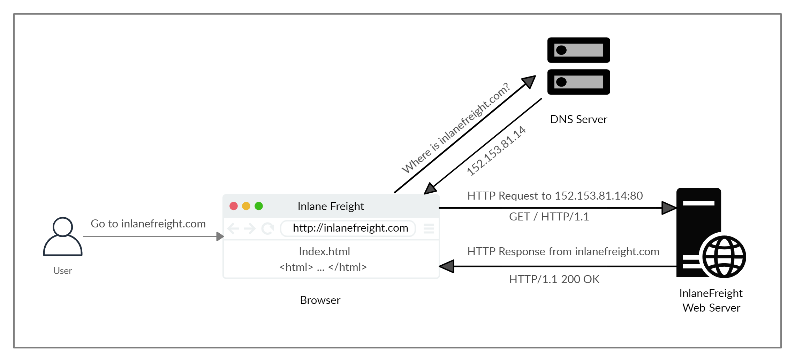
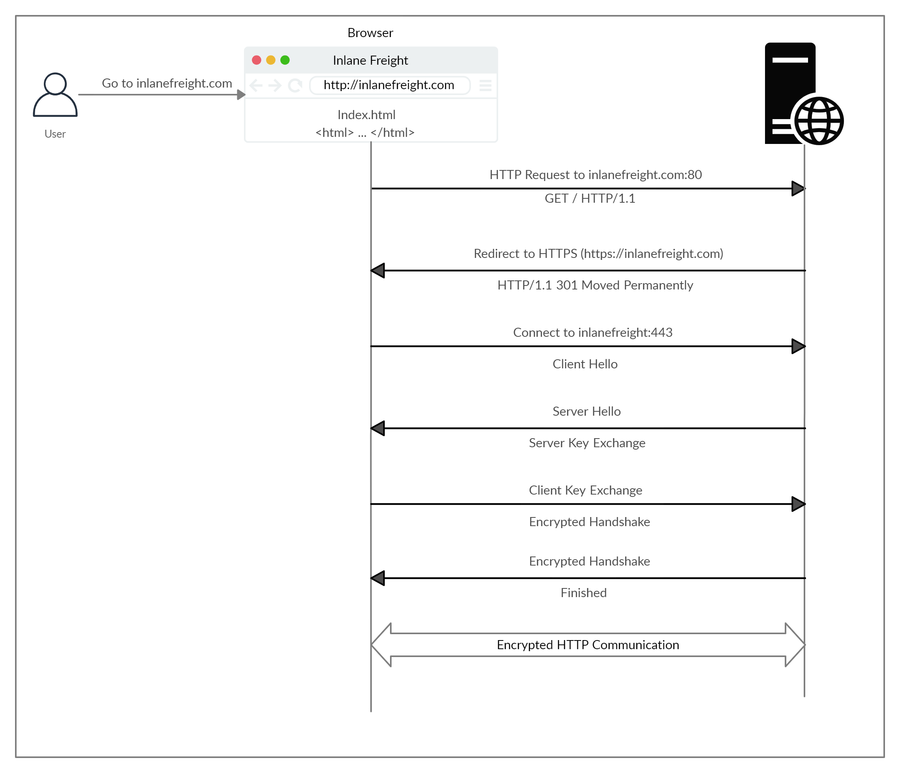

# HyperText Transfer Protocol

La comunicación HTTP consta de un cliente y un servidor, donde el cliente solicita un recurso al servidor. El servidor procesa las solicitudes y devuelve el recurso solicitado. El puerto predeterminado para la comunicación HTTP es el puerto 80, aunque esto se puede cambiar a cualquier otro puerto, dependiendo de la configuracion del servidor web. Normalmente para navegar en internet se utiliza un **Fully Qualified Domain Name (FQDN)** como un **Uniform Resource Locator (URL)** para llegar a un lugar deseado como www.hackthebox.com

## FLujo 

Este diagrama presenta la anatomía de una solicitud HTTP.

1. La primera vez que un usuario ingresa a una URL, esta es consultada con el servidor DNS (Domain Name System), para poder solicitar la ip del dominio
2. El servidor DNS busca la direccion IP para la URL solicitada y la devuelve
3. Una vez que el navegador obtiene la IP vinculada al dominio, se envia una solicitud GET al puerto HTTP.
4. Finalmente el servidor web recibe esta solicitud y la procesa.

# Hypertext Transfer Protocol Secure (HTTPS)

Uno de los principales problemas con HTTP, es que este transfiere los datos sin cifrar. Lo que significa que cualquier persona entre el origen y el destino puede realizar un ataque Man-in-the-midle para ver los datos transferidos.

Para contrarestar este problema, se creo HTTPS donde las comunicaciones se transfieren en formato cifrado.

## Flujo

Si escribimos http:// en lugar de https:// Para visitar un sitio web que aplica HTTPS, el navegador intenta resolver el dominio y redirige al usuario al servidor web que aloja el sitio web de destino. Se envía una solicitud al puerto. 80 Primero, que es el protocolo HTTP no cifrado. El servidor detecta esto y redirige al cliente al puerto HTTPS seguro. 443 en cambio. Esto se hace a través del 301 Moved Permanently código de respuesta, que analizaremos en una próxima sección.

A continuación, el cliente (navegador web) envía un paquete de "hola del cliente", brindando información sobre sí mismo. Después de esto, el servidor responde con un "servidor hola", seguido de un intercambio de claves para intercambiar certificados SSL. El cliente verifica la clave/certificado y envía uno propio. Después de esto, se inicia un protocolo de enlace cifrado para confirmar si el cifrado y la transferencia funcionan correctamente.
Una vez que el protocolo de enlace se completa con éxito, se continúa con la comunicación HTTP normal, que luego se cifra. 