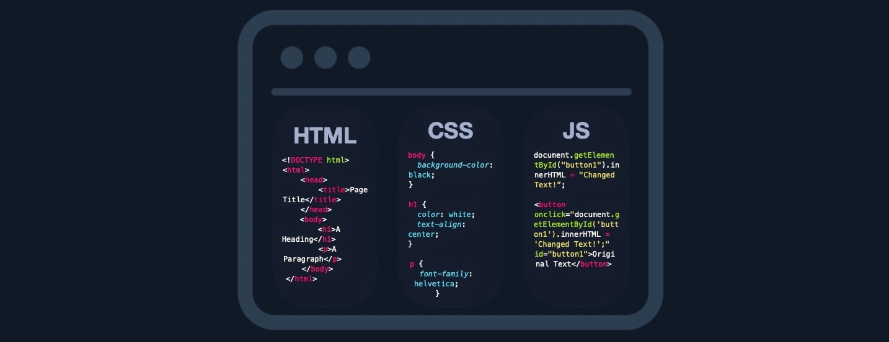

# Front end

Esta parte de la pagina web (Interfaz) contiene los componentes del usuario directamente a traves de su navegador web. Estos componentes constituyen el codigo fuente de la pagina web que podemos ver cuando visitamos una aplicacion web y generalmente incluyen HTML, CSS Y js.

# Back end

El Back-end de una aplicacion web controla todas las funciones principales de la aplicacion web, todas las cuales ejecutan en el servidor back-end, que procesa todo lo necesario para que la aplicacion web se ejecute correctamente.

Ecisten cuatro componentes principales de Back end para aplicaciones web:

1. **Back end Servers** 
    El hardware y el sistema operativo que aloja todos los demas compoenentes y que generalmente se ejecutan en sistemas operativos como Linux, Windows o usando Containers.

2. **Web Servers** 
    Los servidores web manejan solicitudes y conexiones HTTP. Algunos ejemplos son Apache, NGINX y IIS

3. **Databases**
    Bases de datos(DBs) almacenan y recuperan datos de la aplicacion web. Algunos ejemplos de bases de datos relacionales son MySQL, MSSQL, Oracle, PostgreSQL, mientras que bases de datos no relacionaes incluyen NoSQL y MongoDB

4. **Development Frameworks**
    Los marcos de desarrollo se utilizan para desarrollar la aplicación web principal. Algunos marcos bien conocidos incluyen Laravel ( PHP), ASP.NET ( C#), Spring ( Java), Django ( Python), y Express ( NodeJS JavaScript). 

