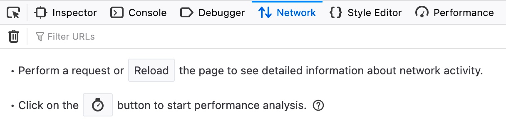

# Cross-Site Scripting (XSS)

Cross-Site Scripting es una de las vulnerabilidades mas comunes en aplicaciones web, dicha vulnerabilidad consta de aprovechar una falla en la desinfeccion de la entrada(input) del usuario para **"escribir"** codigo JavaScript en la pagina y ejecutarlo en el lado del cliente, generando varios tipos de ataques.

- El ataque se ejecuta en el navegador

## Tipos de XSS

- **Stored (Persistent) XSS :** El tipo de XSS mas critico, que ocurre cuando la entrada del usuario se almacena en la base de datops de back-end y luego se muestra al recuperarla
    - Publicaciones o comentarios 

- **Reflected (Non-Persistent) XSS :** Ocurre cuando la entrada del usuario se muestra en la pagina despues de ser procesada por el servidor backend, pero sin ser almacenada
    - resultados de busqueda o mensaje de error 

- **DOM-based XSS :** Otro tipo de XSS no persiste que ocurre cuando la entrada del usuario se muestra directamente en el navegador y se procesa completamente en el lado del cliente, sin llegar al servidor back-end
    - A traves de parametros HTTP del lado del cliente o etiquetas de anclaje

## Stored XSS

Es el ataque mas critico debido a que si este se inyecta, logra almacenarse en la base de datos de back-end y se recupera al visitar la pagina, esto significa que el ataque es **Persistent** y puede afectar a cualquier usuario que visite la pagina.

### Ejemplo

Como ejemplo se tiene una pagina llamada To-Do List, se nos menciona que esta pagina almacena las tareas que le lleguemos a dar.


Intentemos darle algunas tareas y ver que pasa


Como podemos ver pasa lo siguiente:
1. Nuestra entrada se muestra en la pagina, podemos inferir que esta se almacena en la base de datos.
2. Al refrescar la pagina, esta ultima tarea se vuelve a cargar.

Esto quiere decir que este tipo de ataque XSS es posible solo si esta entrada de datos no se desinfecta o se filtra.

***
### Cargas utiles de prueba

Podemos probar si la pagina es vulnerable a XSS con las cargas utiles de XSS basicas

| Código                          | Descripción          |
|---------------------------------|----------------------|
| `<script>alert(window.origin)</script>` | Carga útil XSS básica |
| `<plaintext>` | Carga útil XSS básica |
| `<script>print()</script>` |  |
| `` | Carga útil XSS básica |


Si cargamos el primer payload, podemos visualizar el origen de la pagina web o la URL.


Al visualizar el codigo fuente de la pagina podemos visualizar que la cargfa se ejecuto correctamente.

***
### Reto 
Para obtener la bandera, use la misma carga útil que usamos anteriormente, pero cambie su código JavaScript para mostrar la cookie en lugar de mostrar la URL. 

```
<script>alert(document.cookie)</script>
```

## Reflected XSS

Esta vulnerabilidad es **Non-Persistent** esto quiere decir que la entrada llega al servidor back-end, pero esta no se almacena, lo que son mensajes temporales y una vez que se salga de la pagina no se vovera a ejectuar.

### Ejemplo 

Como ejemplo tenemos la misma pagina pero ahora con unos pequeños cambios.


Al ingresa la palabra test se obtine este mensaje, Task 'test' could not be added, intentare cargar el mismo paylod del ejemplo pasado 

```
<script>alert(window.origin)</script>
```


Dando como resultado, lo esperado, solo que con la diferencia que al buscar nuevamente la pagina este ataque no es persistente a menos que carges la liga de la siguiente manera:

```
http://83.136.254.158:43299/index.php?task=%3Cscript%3Ealert%28window.origin%29%3C%2Fscript%3E
```

La cual contiene el codigo que se esta inyectando por lo cual esta funcionando, pero al buscar solamente

```
http://83.136.254.158:43299
```

La pagina funciana normalente sin el ataque, ya que este no esta almacenado 

## DOM XSS

La entrada de datos, se procesa completamente en el lado del cliente a traves de JavaScript. DOM XSS ocurre cuando se usa JavaScript para cambiar la fuente de la página a través del Document Object Model (DOM). 

Para comprender un poco mas DOM, se tiene que comprender Source y Sink:

- El Source es el objeto JavaScript que toma la entrada del usuario y puede ser cualquier parámetro de entrada como un parámetro de URL o un campo de entrada, como vimos anteriormente. 

- El Sink es la función que escribe la entrada del usuario en un objeto DOM en la página.

Algunas de las funciones de JS comunes utilizadas para escribir objetos DOM son:

- document.write()
- DOM.innerHTML
- DOM.outerHTML

Además, algunos de los jQuery Las funciones de la biblioteca que escriben en objetos DOM son: 
 
- add()
- after()
- append()

```
var pos = document.URL.indexOf("task=");
var task = document.URL.substring(pos + 5, document.URL.length);
document.getElementById("todo").innerHTML = "<b>Next Task:</b> " + decodeURIComponent(task);
```
Como ejemplo tenemos el codigo de la pagina del reto, donde se llega apreciar la funcion **.innerHTML** por lo que puede ser suceptible a ataques DOM XSS

### Ejemplo


Como se puede observar se tiene la siguiente pagina web identica a las anteriores, al momento de cargarle alguna tarea para realizar y analizar las herramienta de red dentro del navegador no vemos, algun metodo HTTP intercambiando informacion por lo que podemos llegar a pensar que todo esto funciona dentro de la pagina.



```

```

al cargar este payload vemos que nos arroja lo esperado


