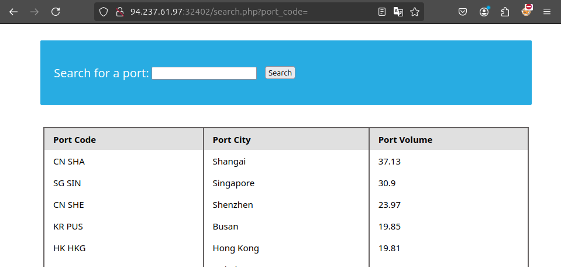
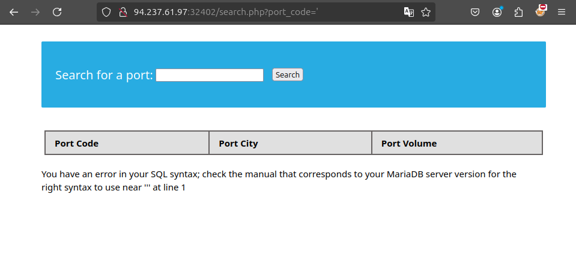
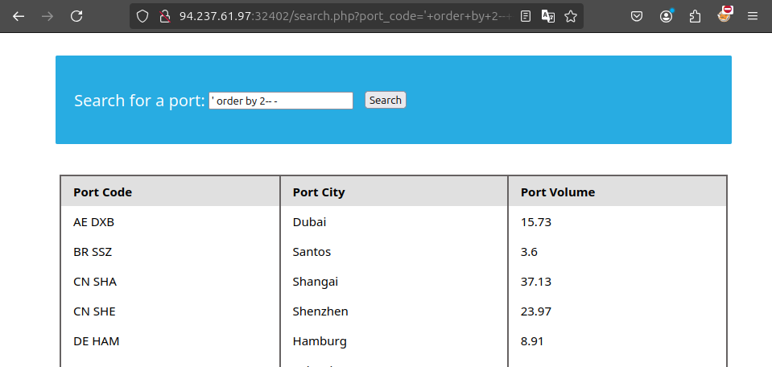
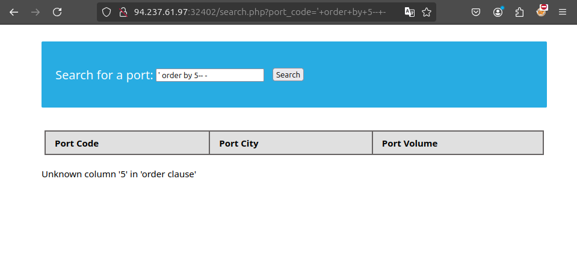
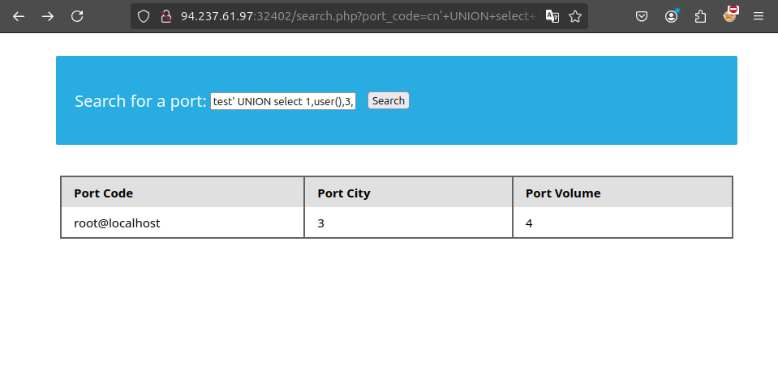

# Union Clause

La clausula Union se utiliza para combinar los resultados de multiples declaraciones SELECT.

Para el ejemplo veamos el contenido de "ports" en la tabla
```
mysql> SELECT * FROM ports;

+----------+-----------+
| code     | city      |
+----------+-----------+
| CN SHA   | Shanghai  |
| SG SIN   | Singapore |
| ZZ-21    | Shenzhen  |
+----------+-----------+
3 rows in set (0.00 sec)
```

Ahora veamos el contenido de "ship"

```
mysql> SELECT * FROM ships;

+----------+-----------+
| Ship     | city      |
+----------+-----------+
| Morrison | New York  |
+----------+-----------+
1 rows in set (0.00 sec)
```

Usemos "UNION" para combinar los resultados

```
mysql> SELECT * FROM ports UNION SELECT * FROM ships;

+----------+-----------+
| code     | city      |
+----------+-----------+
| CN SHA   | Shanghai  |
| SG SIN   | Singapore |
| Morrison | New York  |
| ZZ-21    | Shenzhen  |
+----------+-----------+
4 rows in set (0.00 sec)
```

Como podemos ver. "UNION" combino la salida de ambos "SELECT" en una sola salida con cuatro filas.

# Columnas uniformes

La instruccion "UNION" solo puede operar con "SELECT" con un numero igual de columnas, si eso pasa se tien este error.

```
mysql> SELECT city FROM ports UNION SELECT * FROM ships;

ERROR 1222 (21000): The used SELECT statements have a different number of columns
```

## reto

 Conéctese al servidor MySQL anterior con la herramienta 'mysql' y encuentre el número de registros devueltos al hacer una 'Unión' de todos los registros en la tabla 'empleados' y todos los registros en la tabla 'departamentos'. 

```
SELECT emp_no AS id, first_name AS name
FROM employees
UNION
SELECT NULL AS id, dept_name AS name
FROM departments;
```
# Union Injection



Iniamos usando ' para ver si es injectable



Como podemos ver este error, esto puede significar que la pgina es vulnerable a sql injection.

## Detectar numero de columnas

### Uso de ORDER BY

La primera forma de dectar el numero de columnas es a traves de la funcion ORDER BY, al inyectarlo la consulta ordenara los resultados por una columna especifica.

Podemos empezar con order by 1, ya que se vea que la primera columna ordenada, podemos seguir con order by 2 y posteriormente order by 4, hasta llegar a un numero que devuelva un error





## Reto

Utilice una inyección Union para obtener el resultado de 'user()' 



```
test' UNION select 1,user(),3,4-- -
```