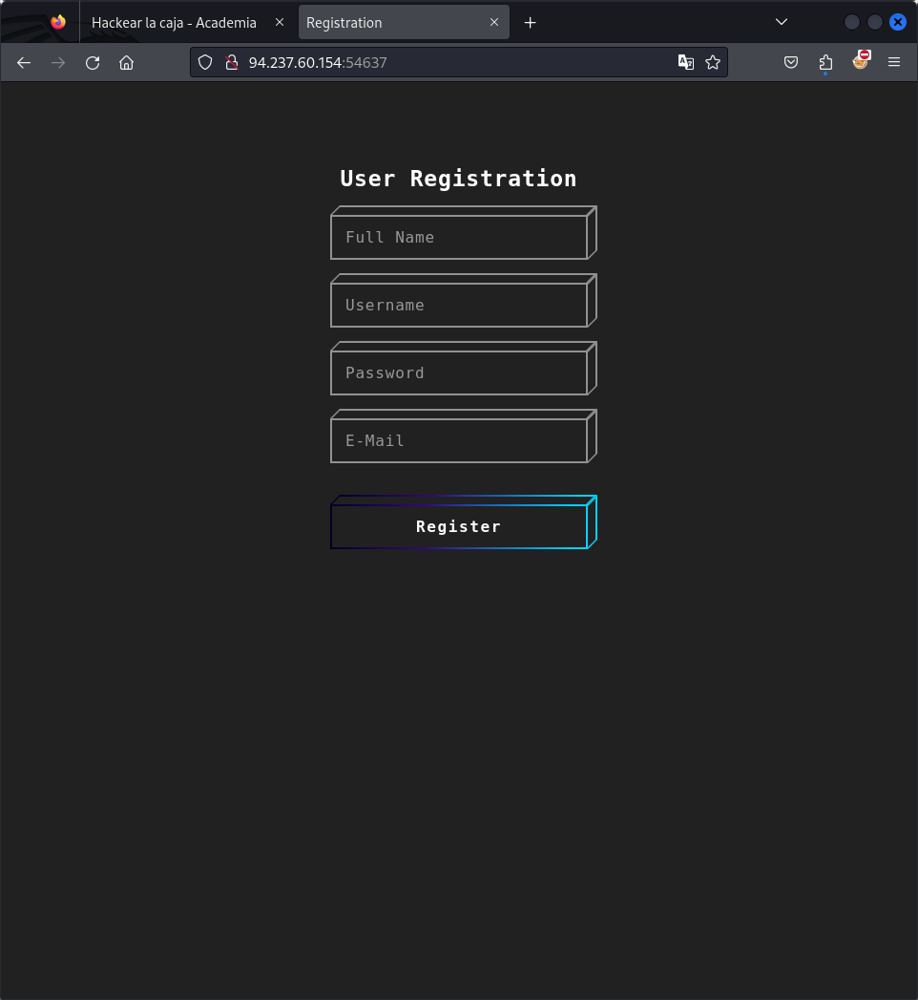
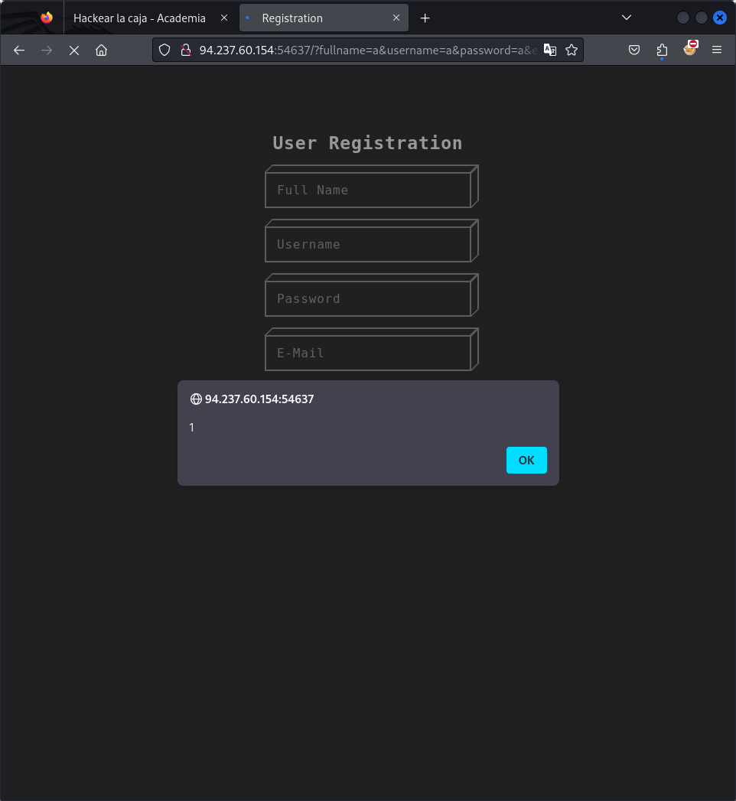

# XSS Discovery

## Descubrimiento automatizado

Algunas herramientas de codigo abierto para ayudarnos con el descubrimiento de XSS son [XSS Strike](https://github.com/s0md3v/XSStrike), [Brute XSS](https://github.com/rajeshmajumdar/BruteXSS) y [XSSer](https://github.com/epsylon/xsser).

```
H4wker@htb[/htb]$ git clone https://github.com/s0md3v/XSStrike.git
H4wker@htb[/htb]$ cd XSStrike
H4wker@htb[/htb]$ pip install -r requirements.txt
H4wker@htb[/htb]$ python xsstrike.py

XSStrike v3.1.4
...SNIP...
```

## Descubrimiento manual

Cuando se trata de descubrimiento XSS manual, la dificultad de encontrar la vulnerabilidad XSS depende del nivel de seguridad de la aplicación web. Las vulnerabilidades XSS básicas generalmente se pueden encontrar probando varias cargas útiles XSS, pero identificar vulnerabilidades XSS avanzadas requiere habilidades avanzadas de revisión de código.

### Cargas utilies

El método más básico para buscar vulnerabilidades XSS es probar manualmente varias cargas útiles XSS en un campo de entrada en una página web determinada. Podemos encontrar listas enormes de cargas útiles XSS en línea, como la de [PayloadAllTheThings](https://github.com/swisskyrepo/PayloadsAllTheThings/tree/master/XSS%20Injection) o la de [PayloadBox](https://github.com/payloadbox/xss-payload-list
). Luego podemos comenzar a probar estas cargas una por una copiándolas y agregándolas en nuestro formulario, y viendo si aparece un cuadro de alerta. 

## Revision de codigo 

El método más confiable para detectar vulnerabilidades XSS es la revisión manual del código, que debe cubrir tanto el código de back-end como el de front-end. Si entendemos con precisión cómo se maneja nuestra entrada hasta que llega al navegador web, podemos escribir una carga útil personalizada que debería funcionar con alta confianza.

En la sección anterior, vimos un ejemplo básico de revisión de código HTML cuando analizamos el Source y Sink para vulnerabilidades XSS basadas en DOM. Esto nos dio un vistazo rápido a cómo funciona la revisión de código de front-end para identificar vulnerabilidades XSS, aunque en un ejemplo de front-end muy básico. 


## Reto


1. Utilice algunas de las técnicas mencionadas en esta sección para identificar el parámetro de entrada vulnerable que se encuentra en el servidor anterior. ¿Cómo se llama el parámetro vulnerable? 

    R = email

2. ¿Qué tipo de XSS se encontró en el servidor anterior? "solo nombre"

    R = Reflected

***
Al realizar pruebas en cada input, no funcionaba la carga util, hasta que una vez ya registrado modificando la URL se obtenia el resultado deseado.

Al modificar la URL y cada que se use esta se sabe que volveria a aparecer esta dicha alerta, debido a que es un ataque xss reflected
```
http://94.237.60.154:54637/?fullname=a&username=a&password=a&email=%3Cscript%3Ealert(1)%3C/script%3E
```
