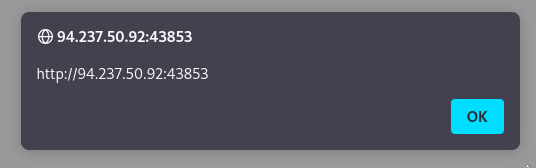

# Cross-Site Scripting (XSS)

Cross-Site Scripting es una de las vulnerabilidades mas comunes en aplicaciones web, dicha vulnerabilidad consta de aprovechar una falla en la desinfeccion de la entrada(input) del usuario para **"escribir"** codigo JavaScript en la pagina y ejecutarlo en el lado del cliente, generando varios tipos de ataques.

- El ataque se ejecuta en el navegador

## Tipos de XSS

- **Stored (Persistent) XSS :** El tipo de XSS mas critico, que ocurre cuando la entrada del usuario se almacena en la base de datops de back-end y luego se muestra al recuperarla
    - Publicaciones o comentarios 

- **Reflected (Non-Persistent) XSS :** Ocurre cuando la entrada del usuario se muestra en la pagina despues de ser procesada por el servidor backend, pero sin ser almacenada
    - resultados de busqueda o mensaje de error 

- **DOM-based XSS :** Otro tipo de XSS no persiste que ocurre cuando la entrada del usuario se muestra directamente en el navegador y se procesa completamente en el lado del cliente, sin llegar al servidor back-end
    - A traves de parametros HTTP del lado del cliente o etiquetas de anclaje

## Stored XSS

Es el ataque mas critico debido a que si este se inyecta, logra almacenarse en la base de datos de back-end y se recupera al visitar la pagina, esto significa que el ataque es **Persistent** y puede afectar a cualquier usuario que visite la pagina.

### Ejemplo

Como ejemplo se tiene una pagina llamada To-Do List, se nos menciona que esta pagina almacena las tareas que le lleguemos a dar.


Intentemos darle algunas tareas y ver que pasa


Como podemos ver pasa lo siguiente:
1. Nuestra entrada se muestra en la pagina, podemos inferir que esta se almacena en la base de datos.
2. Al refrescar la pagina, esta ultima tarea se vuelve a cargar.

Esto quiere decir que este tipo de ataque XSS es posible solo si esta entrada de datos no se desinfecta o se filtra.

***
### Cargas utiles de prueba

Podemos probar si la pagina es vulnerable a XSS con las cargas utiles de XSS basicas

| Código                          | Descripción          |
|---------------------------------|----------------------|
| `<script>alert(window.origin)</script>` | Carga útil XSS básica |
| `<plaintext>` | Carga útil XSS básica |
| `<script>print()</script>` |  |
| `` | Carga útil XSS básica |



Si cargamos el primer payload, podemos visualizar el origen de la pagina web o la URL.


Al visualizar el codigo fuente de la pagina podemos visualizar que la cargfa se ejecuto correctamente.

***
### Reto 
Para obtener la bandera, use la misma carga útil que usamos anteriormente, pero cambie su código JavaScript para mostrar la cookie en lugar de mostrar la URL. 

```
<script>alert(document.cookie)</script>
```
