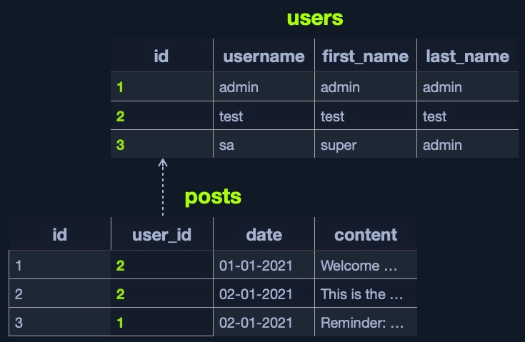
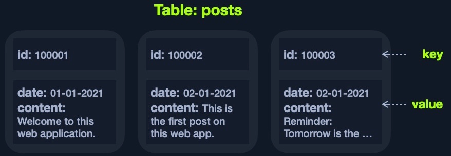

# Sistemas de gestión de bases de datos

UN sitstema de gestión de bases de datos(DBMS) ayuda a crear, definir, alojar y gestionar bases de datos. Existen bases de datos relacionales y las no relacionales.

Algunas caracteristicas escenciales de una DBMS incluyen:

1. **Concurrency**
    Una aplicación del mundo real puede tener varios usuarios interactuando con ella simultáneamente. Un DBMS se asegura de que estas interacciones simultáneas se realicen correspondilentemente sin corromper ni perder ningún dato

2. **Consistency**
    Con tantas interacciones simultáneas, el DBMS debe garantizar que los datos sigan siendo consistentes y válidos en toda la base de datos.

3. **Security**
    DBMS proporciona controles de seguridad detallados a través de permisos y autenticación de usuatios. Esto evitará la visualización o edición no autorizada de datos confidenciales.

4. **Reliability**
    Es facil realizar copias de seguridad de las bases de datos y revertirlas a un estado anterior en caso de pérdida o violación de datos.

5. **Structured Query Language**
    SQL simplifica la interacción del usuario con la base de datos con una sintacis intuitiva que admite diversas operaciones.

# Tipos de Bases de datos

Las bases de datos se clasifican en Relational Databases and Non-Relational Databases.

## Bases de datos relacionales

Una base de datos relacional es un tipo de base de datos que orgniza los datos en filas y columna, que colectivamente forman una tabla donde los puntos de datos están relacionados entre si.

algunas bases de datos que implementan concepto RDBMS:
- Microsoft Access
- MySQL
- SQL Server
- Oracle
- PostgreSQL

## Bases de datos no relacionaes

No utiliza tablas, filas y columnas, ni claves principales, almacena datos utilizando varios modelos de almacenamiento, sewgun el tipo de dato almacenado.

Existen cuatro modelos de almacenamiento NoSQL:

- Key-value
- Document-Based
- Wide-Column
- Graph

Este es un ejemplo de Key-value, un modelo que usualmente guarda sus datos en un JSON o un XML y se tiene la KEY para cada par y almacena todos sus datos como un VALUE.

