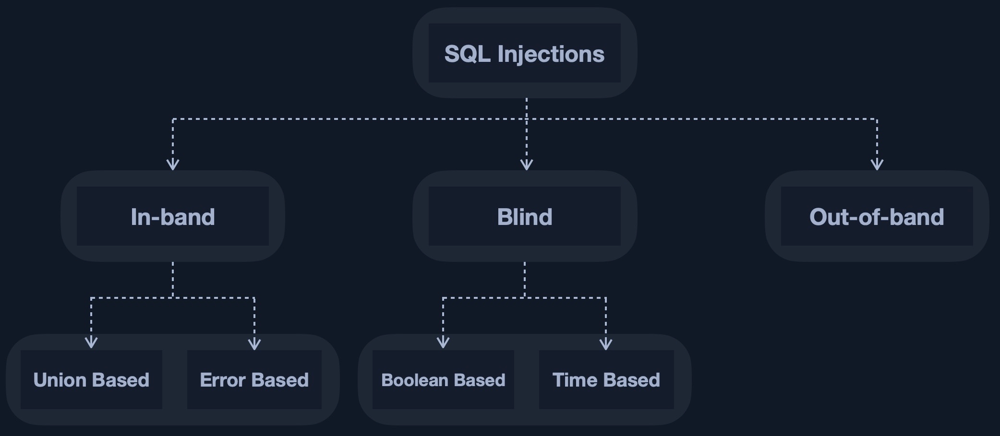

# ¿Qué es una inyección? 

La inyección ocurre cuando una aplicación malinterpreta la entrada del usuario como código real en lugar de una cadena, cambiando el flujo del códifo y ejecutándolo. Esto puede ocurrir al escapar de los limites de entrada del usuario al inyectar un carácter especial como ('), y luego escribir el código para ejecutar, como códigfo JavaSacript o SQL en inyecciones SQL. A menos que se desinfecte la entrada del usuario.

