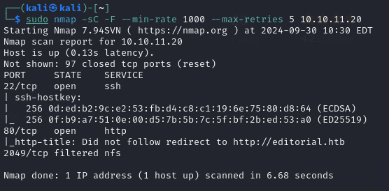
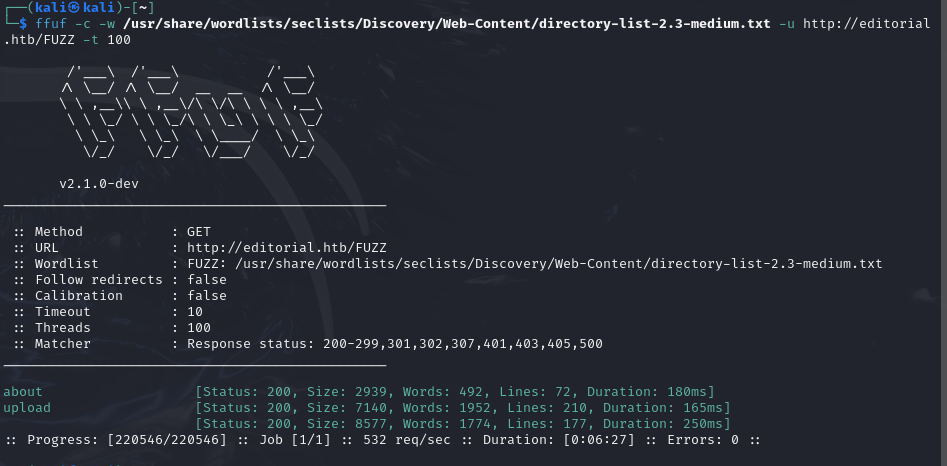
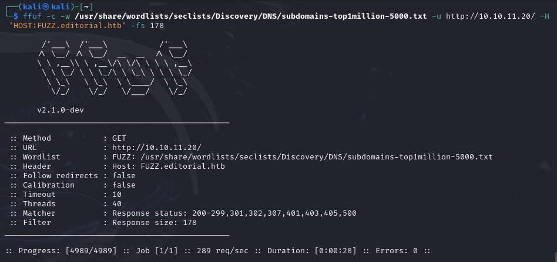

# Editorial Machine 

## Enumeracion 

- Para la enumeracion se obtiene como resultado que se tienen los puertos 22 SSH y el puerto 80 HTTP

- Agregue la ruta http://editorial.htb a mis hosts /etc/hosts para poder acceder al dominio desde mi navegador para proceder con el "crawling"

- Dentro de estos escaneos no se encuentra mucho mas que los directorios "about" y "upload"